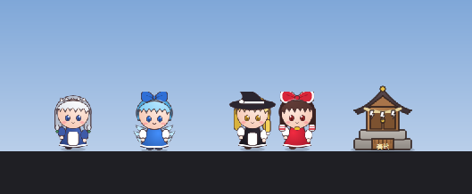

# Hokora — 작업표시줄 위의 나만의 신사 키우기

작업표시줄 위에 작은 신사(호코라)가 생기고, 봉제인형 같은 캐릭터들이 그 위를 돌아다니는 방치형 앱입니다.
켜 두기만 하면 새전이 조금씩 쌓이고, 캐릭터를 쓰다듬거나 잡아서 던지며 놀 수 있습니다.




> 동방 프로젝트의 비공식 2차 창작입니다. / 東方Project二次創作です。 / Unofficial Touhou Project fan work.

## 다운로드

[Releases](../../releases/latest)에서 `hokora.exe`를 받아 실행하면 됩니다. Python을 따로 설치할 필요가 없습니다.

- Windows 10/11 64비트용입니다.
- 서명되지 않은 exe라서 처음 실행할 때 "Windows의 PC 보호" 창이 뜰 수 있습니다. **추가 정보 → 실행**을 누르면 됩니다.
- 아직 만들고 있는 버전(0.x)입니다. 지금은 레이무 혼자 신사를 지키고, 신사 키우기와 캐릭터 해금은 다음 버전에서 추가됩니다.

## 노는 법

| 동작 | 하는 법 |
| --- | --- |
| 쓰다듬기 | 캐릭터를 짧게 클릭. 하트가 뜨고 새전 +1 |
| 들어서 던지기 | 캐릭터를 끌었다가 놓기. 세게 던지면 통통 튑니다 |
| 새전 보기 | 신사에 마우스를 올리기 |
| 신사 옮기기 | 신사를 좌우로 끌기 |
| 메뉴 | 신사를 클릭하거나 아무 캐릭터나 우클릭 (트레이 아이콘 우클릭도 됨) |
| 캐릭터 불러오기 | 트레이 아이콘을 클릭하거나 메뉴 → 모두 불러오기 |

- 캐릭터들은 열려 있는 **창 위에도 올라갑니다.** 가끔 폴짝 뛰어 창 위로 올라가고, 창 끝에서 돌아서거나 뛰어내립니다.
  올라가 있는 창을 끌면 같이 따라가고, 창을 최소화하거나 닫으면 떨어집니다. (메뉴 → **창 위에도 올라가기**로 끄고 켤 수 있음)
- 켜 두면 30초마다 새전이 들어옵니다. 신사가 클수록 많이 들어옵니다.
- 게임이나 영상을 전체화면으로 보면 알아서 숨고, 끝나면 다시 나옵니다.
- 캐릭터와 신사 말고는 화면을 가리지 않습니다. 가만히 있을 때는 CPU를 거의 쓰지 않습니다 (1% 안팎).
- 진행 상황은 자동으로 저장됩니다.

## 만들고 있는 것

- [x] 레이무가 작업표시줄 위를 걷기·앉기, 쓰다듬기, 던지기
- [x] 1단계 신사(호코라)와 새전 쌓이기
- [x] 열려 있는 창 위로 점프해서 올라가고 걸어 다니기
- [ ] 새전으로 신사 키우기: 호코라 → 신사 → 대신사
- [ ] 새 캐릭터 해금: 마리사, 사쿠야, 치르노 …
- [ ] 도감

## 실행하기

Python 3.10 이상이 필요합니다.

```
pip install -r requirements.txt
python hokora.pyw
```

개발용 환경변수:

| 변수 | 효과 |
| --- | --- |
| `HOKORA_ALL=1` | 아직 해금 안 된 캐릭터까지 모두 등장 |
| `HOKORA_DEBUG=1` | 자세한 로그 |

## exe로 빌드하기

```
pip install -r requirements.txt pyinstaller
python build.py
```

`dist\hokora.exe`가 생깁니다.

## 캐릭터 그림 바꾸기

캐릭터는 기본적으로 코드로 그립니다. `hokora/sprites/<캐릭터>/` 폴더에 그림이 있으면 그 그림을 씁니다.

AI 이미지 도구로 **초록 배경(#00FF00)에 여러 자세를 한 장에** 그린 스프라이트 시트를 만들고:

```
python tools/import_sheet.py 시트.png reimu
```

를 실행하면 배경을 지우고 캐릭터를 하나씩 찾아 번호를 붙인 미리보기(`_preview.png`)를 만듭니다.
번호 순서대로 이름을 붙여 다시 실행하면 게임에 들어갑니다.

```
python tools/import_sheet.py 시트.png reimu --names idle,blink,walk_0,walk_1,sit,happy,held,sit_1,idle_1,fall,sleep
```

| 이름 | 쓰이는 곳 |
| --- | --- |
| `idle` / `blink` | 가만히 서 있기 / 눈 깜빡임 |
| `walk_0`, `walk_1` … | 걷기 (번갈아) |
| `sit`, `sit_1` … | 앉기 (4초마다 바꿔 두리번) |
| `happy` | 쓰다듬기 |
| `held` / `fall` | 잡혔을 때 / 던져졌을 때 |
| `sleep` | 잠자기 |

그림은 오른쪽을 보는 방향으로 그리면 됩니다. 왼쪽으로 갈 때는 뒤집어서 씁니다. 코드 그림으로 비교해 보려면 `HOKORA_CODE_ART=1`로 실행합니다.

## 데이터 위치

| 항목 | 경로 |
| --- | --- |
| 저장 | `%APPDATA%\Hokora\save.json` |
| 로그 | `%APPDATA%\Hokora\logs\hokora.log` |
| 자동 실행 (켰을 때만) | 레지스트리 `HKEY_CURRENT_USER\Software\Microsoft\Windows\CurrentVersion\Run` 의 `Hokora` 값 |

이 프로그램은 네트워크 통신을 하지 않습니다. 모든 데이터는 이 PC 안에만 저장됩니다.

## 삭제하기

1. 메뉴에서 **Windows 시작 시 자동 실행**을 켰다면 끕니다.
2. 메뉴 → **종료**
3. `hokora.exe`와 `%APPDATA%\Hokora` 폴더를 지웁니다.

## License

소스 코드는 [MIT License](LICENSE)입니다.

등장 캐릭터(하쿠레이 레이무, 키리사메 마리사, 이자요이 사쿠야, 치르노 등)는 ZUN / 상하이 앨리스 환악단의 동방 프로젝트 캐릭터이며, 권리는 원작자에게 있습니다.
이 프로그램은 공식과 관계없는 비상업 2차 창작입니다. 캐릭터 그림은 원작 게임 소재를 쓰지 않고 코드로 새로 그렸습니다.
