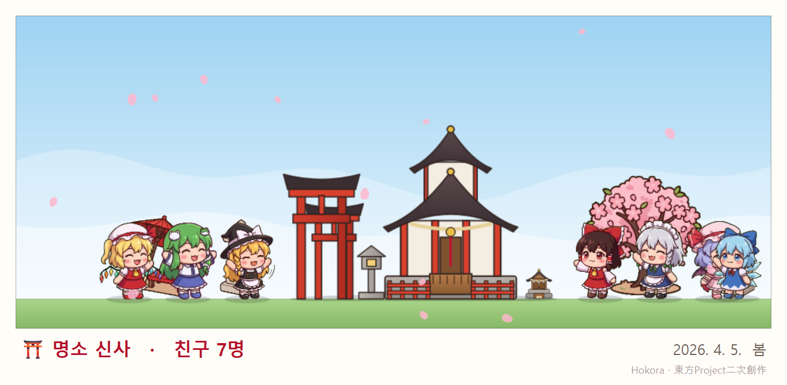

# Hokora — 작업표시줄 위의 나만의 신사 키우기

작업표시줄 위에 작은 신사(호코라)가 생기고, 봉제인형 같은 캐릭터들이 그 위를 돌아다니는 방치형 앱입니다.
켜 두기만 하면 새전이 조금씩 쌓이고, 캐릭터를 쓰다듬거나 잡아서 던지며 놀 수 있습니다.




> 동방 프로젝트의 비공식 2차 창작입니다. / 東方Project二次創作です。 / Unofficial Touhou Project fan work.

## 다운로드

[Releases](../../releases/latest)에서 `hokora.exe`를 받아 실행하면 됩니다. Python을 따로 설치할 필요가 없습니다.

- Windows 10/11 64비트용입니다.
- 서명되지 않은 exe라서 처음 실행할 때 "Windows의 PC 보호" 창이 뜰 수 있습니다. **추가 정보 → 실행**을 누르면 됩니다.
- 처음엔 레이무 혼자 신사를 지키고, 새전을 모으고 신사를 키우면 친구들과 손님이 찾아옵니다.

## 노는 법

| 동작 | 하는 법 |
| --- | --- |
| 쓰다듬기 | 캐릭터를 짧게 클릭. 하트가 뜨고 새전 +1 |
| 들어서 던지기 | 캐릭터를 끌었다가 놓기. 세게 던지면 통통 튑니다 |
| 새전 보기 | 신사에 마우스를 올리기 |
| 신사 관리 · 부탁 · 도감 · 손님 · 꾸미기 | 신사(또는 장식)를 클릭 |
| 사진 찍기 | 우클릭 메뉴 → 📸 사진 찍기 |
| 새전 도둑 잡기 | 새전을 들고 도망가는 마리사를 클릭 |
| 신사 옮기기 | 신사를 좌우로 끌기 |
| 말 걸기 · 선물하기 | 캐릭터를 우클릭 |
| 친구 쉬게 하기 | 캐릭터 우클릭 → 🏠 신사에서 쉬게 하기 (도감에서 다시 내보내기) |
| 메뉴 (설정·종료) | 캐릭터나 신사를 우클릭 (트레이 아이콘 우클릭도 됨) |
| 캐릭터 불러오기 | 트레이 아이콘을 클릭하거나 메뉴 → 모두 불러오기 |

- 캐릭터들은 열려 있는 **창 위에도 올라갑니다.** 가끔 폴짝 뛰어 창 위로 올라가고, 창 끝에서 돌아서거나 뛰어내립니다.
  올라가 있는 창을 끌면 같이 따라가고, 창을 최소화하거나 닫으면 떨어집니다. (메뉴 → **창 위에도 올라가기**로 끄고 켤 수 있음)
- 켜 두면 30초마다 새전이 들어옵니다. 신사가 클수록 많이 들어옵니다.

- **오미쿠지**: 신사 관리 창(또는 우클릭 메뉴)에서 하루 한 번 운세를 뽑습니다. 대길일수록 새전을 많이 받고, 신사가 클수록 더 받습니다.
- **낮잠**: 10분 동안 키보드·마우스를 쓰지 않으면 다들 그 자리에서 낮잠을 잡니다. 돌아오면 깨어나 반겨 줍니다.
- **모니터 여러 대**: 옆 모니터로 걸어서 넘어갑니다. 작업표시줄 높이가 다르면 떨어지거나 점프해서 올라갑니다.
- **마우스 커서**: 커서가 가까이 오면 쳐다보고, 가끔 쫄래쫄래 따라옵니다. 커서를 가만히 두면 **폴짝 뛰어올라 커서 끝에 앉기도** 합니다.
  천천히 움직이면 같이 타고 다니고, 휙 흔들거나 클릭하면 떨어집니다. 커서에 탄 동안에는 클릭이 캐릭터를 통과해서 일에 방해되지 않습니다.
  (메뉴 → **마우스 커서에도 올라타기**로 끄고 켤 수 있음)
- **창 흔들기**: 캐릭터가 올라탄 창을 좌우·위아래로 흔들면 우수수 떨어져서 깜짝 놀랍니다.
- **벽·천장**: 화면 끝 벽에 닿으면 가끔 벽을 타고 오르고, 세게 던지면 천장이나 벽에 매달려 대롱대롱합니다. 모니터 사이 턱도 기어올라 갑니다.

### 오늘의 부탁과 출석 도장

- **출석 도장**: 하루에 한 번 켜면 도장을 찍고 새전을 받습니다. 이어서 찍으면 연속 출석이고,
  **7일째엔 큰 선물**(새전 + 오미쿠지 한 번 더)을 받습니다. 하루라도 빠지면 1일째부터 다시.
- **오늘의 부탁**: 날마다 레이무가 부탁 3개를 합니다 (친구 쓰다듬기, 말 걸기, 선물, 사진 찍기, 새전 모으기 등).
  들어주면 새전을 받고, 셋 다 들어주면 보너스가 있습니다. 신사 관리 창의 **부탁** 탭에서 진행 상황을 볼 수 있습니다.

### 계절과 밤

- 신사 둘레에 계절 따라 **봄엔 벚꽃잎, 가을엔 단풍잎, 겨울엔 눈**이 흩날리고, **여름밤엔 반딧불**이 날아다닙니다.
  신사 주변에서만 흩날리고 클릭은 통과해서 일에 방해되지 않습니다. (메뉴 → **계절 연출**로 끄고 켤 수 있음)
- 밤(저녁 7시~새벽 5시)엔 신사가 푸르스름해지고 등불이 켜집니다. 돌등롱 장식에도 불이 들어옵니다.
- **설날**(1월 1~3일)은 새해 첫 참배: 사흘 동안 새전 수입 2배.

### 사진 찍기

우클릭 메뉴 → **📸 사진 찍기**를 누르면 친구들이 신사 양옆에 줄을 서서 손을 흔들고, 찰칵!
계절과 시간에 맞는 하늘(낮·저녁·밤하늘) 위에 신사와 친구들만 담은 폴라로이드 사진이 됩니다.
뒤에 열려 있던 창이나 바탕화면은 찍히지 않습니다. 사진은 `사진\Hokora` 폴더에 저장되고 클립보드에도 복사되니 바로 붙여 넣어 자랑할 수 있습니다.

### 신사의 일상

- **마주치면 인사**: 친구끼리 가까이 스치면 서로 손을 흔듭니다. 단짝끼리는 특별한 행동을 합니다.
  레이무와 마리사는 나란히 앉아 차를 마시고, 레밀리아는 사쿠야에게 홍차를 시키고, 치르노는 레이무에게 승부를 걸고…
- **놀이**: 가끔 친구들이 모여 **술래잡기**(술래가 쫓아가서 닿으면 술래가 바뀜)나 **탄막놀이**(마주 보고 알록달록한 탄을 주고받음)를 합니다.
- **특기**: 레이무는 가끔 빗자루로 마당을 쓸고, 치르노는 얼음을 던지고(맞은 친구가 깜짝 놀람), 사쿠야는 **시간을 멈춥니다**(다른 친구들이 몇 초 동안 푸르스름하게 멈춤).
  사나에는 **기적**으로 새전을 불러오고, 플랑드르는 레바테인을 휘둘러 근처 친구들을 통 튕겨 날리고, 레밀리아는 **운명을 조작**해서 그날 오미쿠지를 대길·중길로 만듭니다.
- **새전 도둑**: 가끔 마리사가 새전함으로 달려가 새전을 "빌려서" 도망갑니다. 도망가는 마리사를 **클릭하거나 붙잡으면** 돌려받고 보너스까지 받습니다. 놓치면 그대로 잃습니다.

### 친해지기

캐릭터를 **우클릭**하면 말을 걸거나 선물을 줄 수 있습니다. 친해진 정도는 하트 5개로 보이고, 도감에서도 볼 수 있습니다.

- **말 걸기**: 하루 첫 대화마다 조금 친해집니다. 하트 3개부터는 말투가 다정해집니다.
- **선물하기**: 새전으로 간식을 사서 줍니다. 좋아하는 선물이면 훨씬 많이 친해집니다. 하트 2개가 되면 뭘 좋아하는지 메뉴에 ♥로 알려 줍니다.
- **쓰다듬기**: 쓰다듬어도 조금씩 친해집니다. 하트 2개마다 쓰다듬기 새전이 1씩 늘어납니다 (하트 5개면 3배).

| 선물 | 새전 |
| --- | --- |
| 🍵 녹차 | 20 |
| 🍡 경단 · 🍄 버섯 · 🍧 빙수 | 30 |
| ☕ 홍차 · 🍮 푸딩 | 40 |
| 🍰 케이크 | 50 |
| 🍶 술 | 60 |

### 참배

신사 관리 창의 **참배** 탭에서 새전을 넣고 소원을 빌 수 있습니다. 효과는 껐다 켜도 이어집니다.

| 소원 | 효과 | 새전 |
| --- | --- | --- |
| 🍡 간식 나눠 주기 | 모두 신사 앞에 모여 폴짝 기뻐함 | 20 |
| 💰 번영 기원 | 1시간 동안 새전 수입 2배 | 분당 수입 × 40 |
| 💕 인연 기원 | 30분 동안 쓰다듬기 보상 5배 | 50 |
| 🔮 오미쿠지 한 번 더 | 오늘 오미쿠지를 한 번 더 (이미 뽑았을 때) | 100 × 신사 단계 |
| 🧿 도둑 방지 부적 | 24시간 동안 마리사가 새전을 훔치지 않음 | 100 |

### 부적 뽑기 (수여소)

신사 관리 창의 **부적** 탭에서 새전을 내고 부적을 뽑습니다. 부적은 **3개까지 지니면** 효과가 납니다.

- 한 번 뽑는 값은 신사 단계에 따라 50 ~ 500. 10번 뽑기는 한 번 값을 덜 받고 **귀함 이상 하나 보장**.
- 같은 부적이 또 나오면 레벨이 올라 효과가 커집니다 (최대 Lv.5 = 3배). 다 키운 부적이 또 나오면 새전을 조금 돌려줍니다.
- 전설 없이 60번 뽑으면 다음은 꼭 전설 (천장).

| 등급 | 확률 | 부적 (효과) |
| --- | --- | --- |
| 일반 | 60% | 금운 (수입), 복 (쓰다듬기 새전), 학업 (오미쿠지), 건강 (꺼진 동안 새전함), 액막이 (새전 도둑 줄이기) |
| 희귀 | 30% | 상업번성 (수입), 인연 (호감도), 여행 (손님), 개운 (부탁 보상) |
| 귀함 | 8.5% | 용신 (수입), 봉납 (도리이 값 할인), 오니 (스이카의 새전) |
| 전설 | 1.5% | 하쿠레이 (수입), 모리야 (꺼진 동안 새전함), 야쿠모 (손님) |

### 의상실 뽑기

신사 관리 창의 **의상** 탭에서 친구들의 옷과 이펙트를 뽑습니다. **효과는 없고 보기만** 바뀌어서, 값이 비쌉니다
(한 번 1,000 × 신사 단계, 10번 뽑기는 9번 값에 귀함 이상 하나 보장, 80번 천장).

- **옷 색**: 친구마다 4가지 (레이무 파랑·초록·보라·검정, 마리사 남색·보라·빨강·하양 …). 옷 색에 맞춰 눈 색이 바뀌기도 합니다.
- **재질**: 흑백 · 유령(반투명) · 은빛 · **금빛**(전설).
- **그림체**: 지금 그림을 코드로 다른 그림체처럼 — 도트 · 수채화 · 연필 스케치 · **네온**(전설).
- **이펙트**: 걸을 때 남는 하트·벚꽃·별·**무지개** 발자국, 음표, 반짝이 오라. 누구에게나 씌울 수 있습니다.
- 중복은 **옷감**이 되고, 옷감으로 원하는 옷·이펙트를 직접 교환할 수 있습니다. 주마다 한 친구의 옷이 **픽업**(확률 3배).
- 입히기는 의상 탭에서 친구를 고르거나, 캐릭터 우클릭 → **👘 옷 갈아입기 / ✨ 이펙트**.
- 전용 의상(유카타 등)은 그림을 뽑아 넣으면 전설로 추가됩니다 → [docs/PROMPTS.md](docs/PROMPTS.md)

### 신사 꾸미기

신사 관리 창의 **꾸미기** 탭에서 장식을 사서 신사 옆에 놓을 수 있습니다. 놓은 장식마다 분당 새전이 늘고, 좌우로 끌어서 옮길 수 있습니다.
화면이 복잡하면 **꾸미기 탭의 "신사 옆에 장식 보이기"**(또는 우클릭 메뉴 → 장식 보이기)를 끄세요. 장식이 안 보이기만 하고 새전 보너스는 그대로입니다.

| 장식 | 가격 | 분당 새전 |
| --- | --- | --- |
| 풍경 | 150 | +1 |
| 돌등롱 | 200 | +1 |
| 오미쿠지 걸이 · 에마 걸이 | 300 | +1 |
| 여우 석상 | 400 | +1 |
| 빨간 양산 | 500 | +1 |
| 손 씻는 물 | 600 | +2 |
| 벚꽃나무 | 800 | +2 |
| 큰 새전함 | 1,000 | +3 |

### 신사 모양·크기·외출

신사 관리 창의 **꾸미기** 탭에서 바꿀 수 있습니다.

- **신사 모양**: 키운 단계 안에서 신사 모양만 고를 수 있습니다 (5단계까지 키워도 1단계 호코라 모양으로 두기 등). 수입은 가장 높이 올린 단계 그대로입니다.
- **크기**: 신사·캐릭터·장식을 보통 / 작게 / 아주 작게 중에서 고릅니다.
- **외출**: 도감 탭에서 친구마다 **밖에 나와 있기**를 끄면 그 친구는 신사 안에서 쉬고 작업표시줄에 나오지 않습니다.

### 센본토리이

후시미 이나리 신사처럼 신사 옆에 도리이를 하나씩 봉납합니다 (신사 관리 창 → 신사 탭).

- 하나 봉납할 때마다 값이 조금씩 오릅니다 (300, 330, 360 …). 10개씩 한꺼번에 봉납할 수도 있습니다.
- 도리이 2개마다 분당 새전 +1.
- 10 · 50 · 100 · 300 · 1000개에 칭호: 참배길 → 붉은 터널 → 도리이 숲 → 이나리의 길 → **센본토리이**.
- 신사 옆에는 최근 12개가 줄지어 서 있고, 마우스를 올리면 모두 몇 개인지 보입니다.

### 신사 키우기

신사를 클릭하면 신사 관리 창이 열립니다. 모은 새전으로 신사를 키울 수 있습니다.

| 단계 | 비용 | 분당 새전 |
| --- | --- | --- |
| 호코라 | 처음부터 | 2 |
| 신사 | 300 | 5 |
| 대신사 | 1,500 | 12 |
| 명소 신사 | 5,000 | 25 |
| 환상향 제일 신사 | 15,000 | 50 |

신사가 커질 때마다 벚꽃잎이 흩날립니다.

### 새전함과 신사 일기

**새전함**을 키우면 Hokora 를 꺼 둔 동안에도 새전이 쌓입니다 (신사 관리 창 → 신사 탭).

| 새전함 | 비용 | 꺼져 있는 동안 |
| --- | --- | --- |
| Lv.0 | 처음부터 | 최대 1시간, 수입의 25% |
| Lv.1 | 300 | 최대 2시간, 50% |
| Lv.2 | 1,000 | 최대 4시간, 50% |
| Lv.3 | 3,000 | 최대 8시간, 75% |
| Lv.4 | 8,000 | 최대 12시간, 100% |

10분 넘게 끄거나 자리를 비웠다가 돌아오면 **신사 일기**가 떠서, 그동안 친구들이 뭘 했는지와 모인 새전을 알려 줍니다.

### 손님

가끔 신사에 손님이 찾아옵니다. 신사가 커질수록 찾아오는 손님이 늘어납니다. 손님을 우클릭하면 말을 걸 수 있습니다.

| 손님 | 찾아오는 때 | 하는 일 |
| --- | --- | --- |
| 세 요정 (서니·루나·스타) | 처음부터 | 몰래 와서 장난. 서니는 반투명하게 숨어서 새전을 조금 털고 장식 하나를 숨기고, 루나는 소리를 지워 친구들 말풍선이 "……"가 되고, 스타는 망을 봅니다. **요정을 클릭하거나 붙잡으면** 사과하고 새전을 두고 갑니다 (서니를 잡으면 훔친 새전도 돌려받음). 커서가 다가오면 스타가 알아채고 모두 도망가니 재빨리! |
| 샤메이마루 아야 | 신사 2단계부터 | 하늘에서 휙 내려와 친구 하나를 취재하고 사진을 찍은 뒤 **붕붕마루 신문 호외**를 냅니다. 기사가 나면 30분 동안 새전 수입 1.5배 |
| 이부키 스이카 | 신사 3단계부터 | 안개로 나타나 술을 마시며 비틀비틀. 기분이 좋으면 새전을 크게 두고 갑니다. 우클릭 → **술 대접하기**를 하면 꼭, 두 배로 |

신사 관리 창의 **손님** 탭에서 다녀간 손님과 붕붕마루 신문 스크랩을 볼 수 있습니다.

### 새 친구 만나기 (도감)

조건을 채우면 새 캐릭터가 하늘에서 신사로 찾아옵니다. 아직 못 만난 캐릭터는 도감에 실루엣과 조건, 진행률로 보입니다.

| 캐릭터 | 찾아오는 조건 |
| --- | --- |
| 하쿠레이 레이무 | 처음부터 (신사의 주인) |
| 키리사메 마리사 | 새전을 모두 합쳐 100 모으기 |
| 치르노 | 50번 쓰다듬기 |
| 이자요이 사쿠야 | 신사를 2단계로 키우고, 함께한 시간 2시간 |
| 코치야 사나에 | 오미쿠지 3번 뽑기 + 신사 2단계 |
| 레밀리아 스칼렛 | 밤(저녁 8시~새벽 5시)에 함께한 시간 1시간 |
| 플랑드르 스칼렛 | 레밀리아를 만나고, 새전 도둑 3번 잡기 |
- 게임이나 영상을 전체화면으로 보면 알아서 숨고, 끝나면 다시 나옵니다.
- 캐릭터와 신사 말고는 화면을 가리지 않습니다. 가만히 있을 때는 CPU를 거의 쓰지 않습니다 (1% 안팎).
- 진행 상황은 자동으로 저장됩니다.

## 만들고 있는 것

- [x] 레이무가 작업표시줄 위를 걷기·앉기, 쓰다듬기, 던지기
- [x] 1단계 신사(호코라)와 새전 쌓이기
- [x] 열려 있는 창 위로 점프해서 올라가고 걸어 다니기
- [x] 새전으로 신사 키우기: 호코라 → 신사 → 대신사
- [x] 새 캐릭터 해금: 마리사, 치르노, 사쿠야
- [x] 도감
- [x] 오미쿠지, 낮잠, 모니터 여러 대
- [x] 캐릭터끼리 인사·특기, 마리사 새전 도둑
- [x] 신사 꾸미기
- [x] 참배 (간식·번영·인연·오미쿠지·부적)
- [x] 새 캐릭터: 사나에, 레밀리아, 플랑드르
- [x] 화면 놀이: 마우스 커서 올라타기·따라가기, 창 흔들기, 벽 타기·매달리기
- [x] 새전함 (꺼져 있는 동안 수입), 신사 일기, 신사 4·5단계
- [x] 호감도·선물·말 걸기, 단짝 행동, 술래잡기·탄막놀이
- [x] 손님 방문: 세 요정, 아야, 스이카
- [x] 오늘의 부탁·출석 도장, 계절·밤 연출, 사진 찍기
- [x] 신사 모양·크기 고르기, 친구 쉬게 하기, 센본토리이, 부적 뽑기
- [x] 의상실 뽑기 (옷 색·재질 스킨, 발자국 이펙트, 옷감 교환)
- [ ] 전용 의상 그림 (유카타·산타 …)
- [ ] 요우무
- [ ] 계절 의상, 새 손님

## 실행하기

Python 3.10 이상이 필요합니다.

```
pip install -r requirements.txt
python hokora.pyw
```

전체 기능 시험 (2분쯤, 임시 폴더에 저장하므로 진짜 저장·사진·클립보드는 그대로):

```
python tests/smoke.py
```

개발용 환경변수:

| 변수 | 효과 |
| --- | --- |
| `HOKORA_ALL=1` | 아직 해금 안 된 캐릭터까지 모두 등장 |
| `HOKORA_DEBUG=1` | 자세한 로그 |
| `HOKORA_GUEST=fairies` | 켜자마자 손님이 옴 (`fairies` / `aya` / `suika`) |
| `HOKORA_SEASON=winter` | 계절 바꿔 보기 (`spring` / `summer` / `autumn` / `winter`) |
| `HOKORA_NIGHT=1` | 밤으로 (`0` 이면 낮으로) |

## exe로 빌드하기

```
pip install -r requirements.txt pyinstaller
python build.py
```

`dist\hokora.exe`가 생깁니다.

## 캐릭터 그림 바꾸기

캐릭터는 기본적으로 코드로 그립니다. `hokora/sprites/<캐릭터>/` 폴더에 그림이 있으면 그 그림을 씁니다.

Gemini 에 줄 프롬프트는 [docs/PROMPTS.md](docs/PROMPTS.md)에 정리되어 있습니다 (캐릭터당 표준 시트 3장 + 신사 장식).
표준 시트는 `--preset move|react|life` 로 넣으면 이름이 자동으로 붙습니다.

AI 이미지 도구로 **초록 배경(#00FF00)에 여러 자세를 한 장에** 그린 스프라이트 시트를 만들고:

```
python tools/import_sheet.py 시트.png reimu
```

를 실행하면 배경을 지우고 캐릭터를 하나씩 찾아 번호를 붙인 미리보기(`_preview.png`)를 만듭니다.
번호 순서대로 이름을 붙여 다시 실행하면 게임에 들어갑니다.

```
python tools/import_sheet.py 시트.png reimu --names idle,blink,walk_0,walk_1,sit,happy,held,sit_1,idle_1,fall,sleep
```

| 이름 | 쓰이는 곳 |
| --- | --- |
| `idle` / `blink` | 가만히 서 있기 / 눈 깜빡임 |
| `walk_0`, `walk_1` … | 걷기 (번갈아) |
| `sit`, `sit_1` … | 앉기 (4초마다 바꿔 두리번) |
| `happy` | 쓰다듬기 |
| `held` / `fall` | 잡혔을 때 / 던져졌을 때 |
| `sleep` | 잠자기 |

그림은 오른쪽을 보는 방향으로 그리면 됩니다. 왼쪽으로 갈 때는 뒤집어서 씁니다. 코드 그림으로 비교해 보려면 `HOKORA_CODE_ART=1`로 실행합니다.

## 데이터 위치

| 항목 | 경로 |
| --- | --- |
| 저장 | `%APPDATA%\Hokora\save.json` |
| 로그 | `%APPDATA%\Hokora\logs\hokora.log` |
| 사진 | `사진\Hokora\` (보통 `%USERPROFILE%\Pictures\Hokora`) |
| 자동 실행 (켰을 때만) | 레지스트리 `HKEY_CURRENT_USER\Software\Microsoft\Windows\CurrentVersion\Run` 의 `Hokora` 값 |

이 프로그램은 네트워크 통신을 하지 않습니다. 모든 데이터는 이 PC 안에만 저장됩니다.

## 삭제하기

1. 메뉴에서 **Windows 시작 시 자동 실행**을 켰다면 끕니다.
2. 메뉴 → **종료**
3. `hokora.exe`와 `%APPDATA%\Hokora` 폴더를 지웁니다.
4. 찍은 사진(`사진\Hokora`)은 필요 없으면 지웁니다.

## License

소스 코드는 [MIT License](LICENSE)입니다.

등장 캐릭터(하쿠레이 레이무, 키리사메 마리사, 이자요이 사쿠야, 치르노 등)는 ZUN / 상하이 앨리스 환악단의 동방 프로젝트 캐릭터이며, 권리는 원작자에게 있습니다.
이 프로그램은 공식과 관계없는 비상업 2차 창작입니다. 캐릭터 그림은 원작 게임 소재를 쓰지 않고 코드로 새로 그렸습니다.
